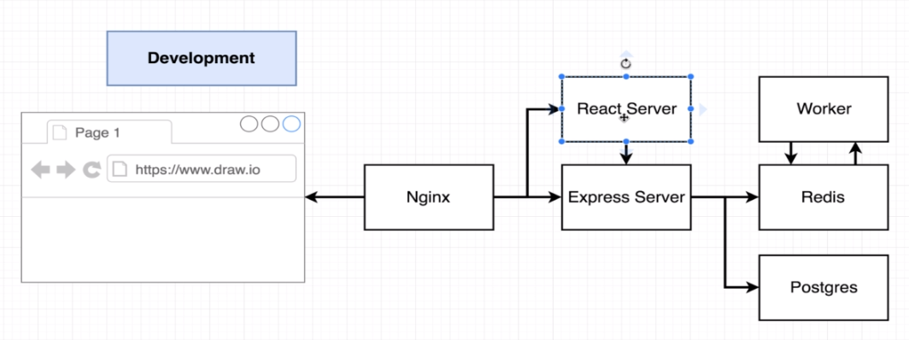
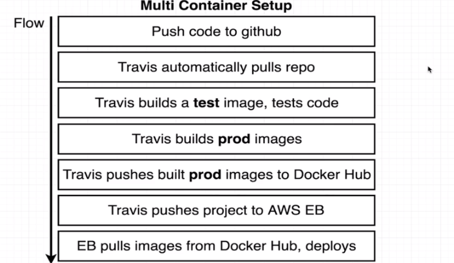

### multi container applications in docker

##### scope
* scope is a small app, that finds the fibbocnacci number of  given index
* store the numbers in a *postgress* and also store the already known indecies to *redis*
* then if the client request a computation we aggregate from this two databases  

##### env
* we also will create several enviroments like
* **dev** runs locally
* **prod** will be deployed to AWS, after certain TRAVIS CI tests succed
* for dev we also mount VOLUMES into docker container to gain the hot reload from `nodemon`

##### development
> consider the following for development:

* this repo tghen combines several services `docker-compose.yml`
* we have a 
  * **server** will combine and postgres and redis and knows our internal routes
  * **worker** will calculated fibonacci number 
  * **client** will ask for input and display relevant data
  * **nginx**  will redirect client request internally to `/api` or `/`
* also there is a *nginx* that handles the internal routing for the *client* and *worker* services

##### production
> consider the following flow for prod:

